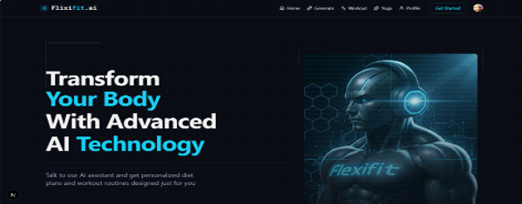
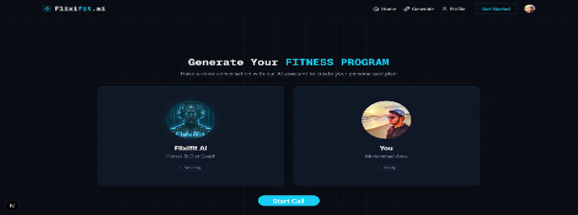
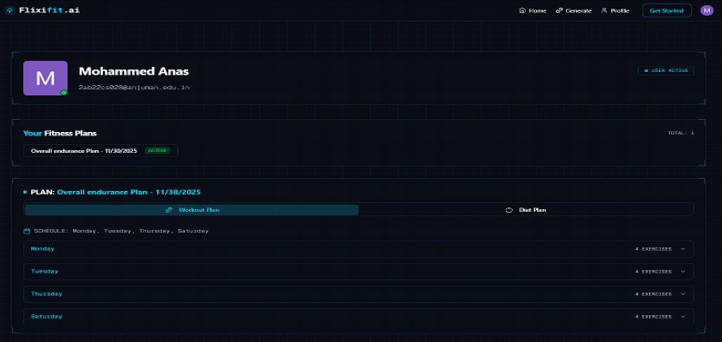
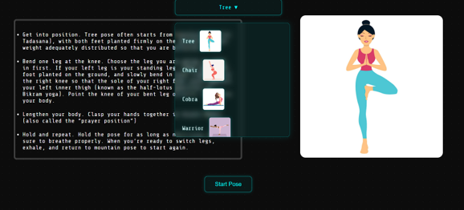
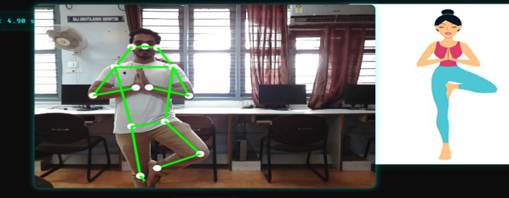
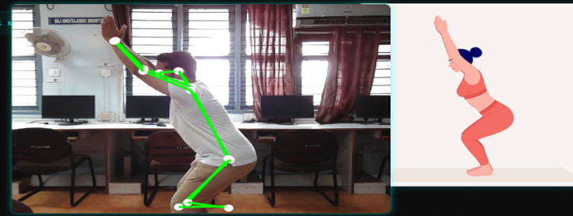
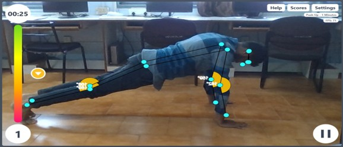
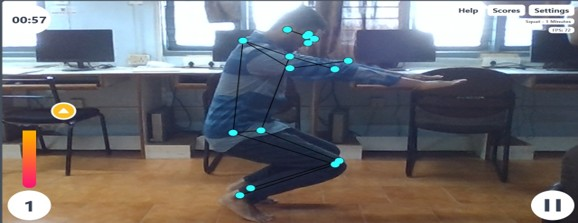

# 🏋️ FlexiFit – AI Personalized Fitness Coach

<div align="center">


**An intelligent AI-powered virtual fitness trainer that provides real-time posture correction, repetition counting, yoga guidance, and personalized diet & workout planning.**

*Final Year Project — Department of CSE, AITM, Bhatkal*

</div>

---

## 📌 Table of Contents

- [Project Overview](#-project-overview)
- [System Architecture](#-system-architecture)
- [Screenshots](#-screenshots)
- [Features](#-features)
- [Tech Stack](#-tech-stack)
- [Prerequisites](#-prerequisites)
- [Step 1 — Main Web App (FlexiFit)](#-step-1--main-web-app-flexifit)
- [Step 2 — Workout Tracker Module](#-step-2--workout-tracker-module)
- [Step 3 — Yoga Pose Tracker Module](#-step-3--yoga-pose-tracker-module)
- [Project Structure](#-project-structure)
- [Environment Variables](#-environment-variables)

---

## 🧠 Project Overview

FlexiFit is a comprehensive AI-based fitness coaching platform that eliminates the need for a physical trainer. It uses **MediaPipe BlazePose** and **TensorFlow.js** to detect human body landmarks in real time and provide corrective feedback during workouts and yoga sessions. The platform also generates personalized diet and workout plans using **Gemini AI** via a voice-based conversation interface.

---

## 🏗 System Architecture

The project is divided into **three separate modules**, each serving a distinct purpose:

| # | Module | Folder | Technology | Port |
|---|--------|--------|------------|------|
| 1 | **Main Web App** | `flexifit/` | Next.js 15, Clerk Auth, Convex DB, Vapi AI | `3000` |
| 2 | **Workout Tracker** | `workout/` | Webpack, MediaPipe Pose, TensorFlow.js | `8080` |
| 3 | **Yoga Pose Tracker** | `yo/` | React (CRA), TensorFlow.js, pose-detection | `3001` |

---

## 📸 Screenshots

### 🌐 Main Web App — FlexiFit









---

### 🏃 Workout Tracker & Yoga Module









---

## ✨ Features

- 🎙️ **Voice-Based AI Program Generation** — Talk to an AI assistant to get personalized fitness plans
- 🏃 **Real-Time Pose Estimation** — MediaPipe BlazePose detects 33 body landmarks
- ✅ **Posture Correction Feedback** — Instant "Go Up / Go Down" style guidance
- 🔢 **Automatic Rep Counting** — Counts only valid repetitions based on joint angles
- 🧘 **Yoga Pose Guidance** — Real-time yoga posture analysis and alignment feedback
- 🥗 **AI Diet Planner** — Personalized nutrition plans via Gemini AI
- 📊 **Progress Tracking** — Workout history, rep counts, and session logs
- 🔐 **User Authentication** — Secure login/signup via Clerk
- 📱 **Responsive Design** — Works on desktop and mobile browsers

---

## 🛠 Tech Stack

| Component | Technology |
|-----------|------------|
| Frontend (Main App) | Next.js 15, React 19, TailwindCSS |
| Authentication | Clerk |
| Database | Convex |
| AI Voice Assistant | Vapi AI |
| AI Plan Generator | Google Gemini AI |
| Pose Estimation | MediaPipe BlazePose |
| ML Framework | TensorFlow.js |
| Workout Module | Webpack 5, Vanilla JS |
| Yoga Module | React (CRA), react-webcam |
| Camera Access | WebRTC |

---

## ⚙️ Prerequisites

Make sure the following are installed on your system before running any module:

- **Node.js** v18 or higher — [Download](https://nodejs.org/)
- **npm** v9 or higher (comes with Node.js)
- A working **webcam** (720p or higher recommended)
- A modern browser: **Google Chrome** or **Firefox** (latest)

---

---

## 🚀 Step 1 — Main Web App (FlexiFit)

> The main Next.js application. Handles user authentication, AI-powered program generation via voice call, and displaying personalized workout & diet plans.

### 1.1 — Navigate to the folder

```bash
cd flexifit
```

### 1.2 — Install dependencies

```bash
npm install
```

### 1.3 — Set up environment variables

Create a `.env.local` file in the `flexifit/` folder with the following keys:

```env
# Clerk Authentication
NEXT_PUBLIC_CLERK_PUBLISHABLE_KEY=your_clerk_publishable_key
CLERK_SECRET_KEY=your_clerk_secret_key

NEXT_PUBLIC_CLERK_SIGN_IN_URL=/sign-in
NEXT_PUBLIC_CLERK_SIGN_UP_URL=/sign-up

# Vapi AI (Voice Assistant)
NEXT_PUBLIC_VAPI_WORKFLOW_ID=your_vapi_workflow_id
NEXT_PUBLIC_VAPI_API_KEY=your_vapi_api_key

# Convex Database
CONVEX_DEPLOYMENT=dev:your-convex-deployment
NEXT_PUBLIC_CONVEX_URL=https://your-deployment.convex.cloud
```

> 💡 Get your Clerk keys at [clerk.com](https://clerk.com), Vapi keys at [vapi.ai](https://vapi.ai), and Convex keys at [convex.dev](https://convex.dev)

### 1.4 — Start the Convex backend (in a separate terminal)

```bash
npx convex dev
```

### 1.5 — Start the development server

```bash
npm run dev
```

### 1.6 — Open in browser

```
http://localhost:3000
```

**What you can do:**
- Register / Sign in with Clerk authentication
- Click **"Build Your Program"** to start a voice conversation with the AI
- View generated personalized workout and diet plans on your profile

---

---

## 🏃 Step 2 — Workout Tracker Module

> A standalone Webpack-based app that uses MediaPipe BlazePose and TensorFlow.js for real-time exercise pose detection, rep counting, and posture feedback via webcam.

### 2.1 — Navigate to the folder

```bash
cd workout
```

### 2.2 — Install dependencies

```bash
npm install
```

### 2.3 — Build TailwindCSS styles (in a separate terminal)

```bash
npm run tw-serve-dev
```

> This watches and compiles the TailwindCSS styles into `public/stylesheets/output.css`

### 2.4 — Start the development server (in another terminal)

```bash
npm run start-dev
```

### 2.5 — Open in browser

```
http://localhost:8080
```

**What you can do:**
- Select a workout type (e.g., Bicep Curl, Squat, Push-Up)
- Choose workout duration
- Allow webcam access
- The AI will count your reps and guide your posture in real time
- View your workout journey scores and best records

> ⚠️ **Note:** Allow camera access when the browser prompts. Ensure you are in a well-lit area for best pose detection accuracy.

---

---

## 🧘 Step 3 — Yoga Pose Tracker Module

> A React application that provides real-time yoga pose guidance using TensorFlow.js pose detection and a webcam feed.

### 3.1 — Navigate to the folder

```bash
cd yo
```

### 3.2 — Install dependencies

```bash
npm install
```

### 3.3 — Start the development server

```bash
npm start
```

### 3.4 — Open in browser

```
http://localhost:3001
```

> If port `3001` is not auto-selected, React CRA will prompt you — press **Y** to use the next available port.

**What you can do:**
- Browse available yoga poses from the home page
- Click **"Start"** to open the live yoga session
- Grant webcam access for real-time pose analysis
- Follow the on-screen guidance to hold poses correctly
- Get visual feedback on pose alignment and accuracy

> ⚠️ **Note:** TensorFlow.js model loading may take a few seconds on first load. Ensure your device supports WebGL for optimal performance.

---

---

## 📁 Project Structure

```
Flexi-fit Ai Fitness Trainer/
│
├── flexifit/                        # 🌐 Main Web Application (Next.js)
│   ├── src/
│   │   ├── app/
│   │   │   ├── page.tsx             # Landing page
│   │   │   ├── generate-program/    # Voice AI program generation
│   │   │   ├── profile/             # User profile & saved plans
│   │   │   └── (auth)/              # Clerk auth pages
│   │   ├── components/              # Reusable UI components
│   │   │   ├── Navbar.tsx
│   │   │   ├── Footer.tsx
│   │   │   ├── UserPrograms.tsx
│   │   │   └── TerminalOverlay.tsx
│   │   ├── constants/               # Static data & program samples
│   │   ├── lib/                     # Vapi & utility helpers
│   │   └── providers/               # Convex & Clerk providers
│   ├── convex/                      # Convex backend functions & schema
│   │   ├── schema.ts
│   │   ├── plans.ts
│   │   ├── users.ts
│   │   └── http.ts
│   ├── public/                      # Static assets & images
│   └── .env.local                   # Environment variables (not committed)
│
├── workout/                         # 🏃 Workout Tracker Module (Webpack)
│   ├── src/
│   │   ├── index.js                 # Main application logic
│   │   ├── input.css                # TailwindCSS source
│   │   ├── template.html            # HTML template
│   │   ├── components/              # UI components
│   │   └── handlers/                # Pose, timer, score, settings handlers
│   └── public/
│       ├── rules/                   # Exercise rule configs (JSON)
│       ├── models/                  # TensorFlow.js classifier models
│       └── mock-data/               # Workout configuration data
│
└── yo/                              # 🧘 Yoga Pose Tracker Module (React CRA)
    ├── src/
    │   ├── App.js                   # Router & entry point
    │   ├── pages/
    │   │   ├── Home/                # Yoga pose selection page
    │   │   ├── Yoga/                # Live yoga session page
    │   │   └── Tutorials/           # Pose tutorial pages
    │   ├── components/
    │   │   ├── DropDown/            # Pose selector dropdown
    │   │   ├── Instrctions/         # Pose instruction display
    │   │   └── PoseStart/           # Webcam pose detection component
    │   └── utils/                   # Angle calculation & pose utilities
    └── public/                      # Static assets
```

---

## 🔐 Environment Variables

Only the **Main Web App** (`flexifit/`) requires environment variables. The Workout and Yoga modules run entirely client-side with no API keys needed.

| Variable | Description | Where to Get |
|----------|-------------|--------------|
| `NEXT_PUBLIC_CLERK_PUBLISHABLE_KEY` | Clerk public key for auth | [clerk.com](https://clerk.com) |
| `CLERK_SECRET_KEY` | Clerk secret key for auth | [clerk.com](https://clerk.com) |
| `NEXT_PUBLIC_VAPI_WORKFLOW_ID` | Vapi voice AI workflow ID | [vapi.ai](https://vapi.ai) |
| `NEXT_PUBLIC_VAPI_API_KEY` | Vapi API key | [vapi.ai](https://vapi.ai) |
| `CONVEX_DEPLOYMENT` | Convex project deployment name | [convex.dev](https://convex.dev) |
| `NEXT_PUBLIC_CONVEX_URL` | Convex cloud URL | [convex.dev](https://convex.dev) |

---

## 🎓 Academic Information

| Field | Details |
|-------|---------|
| **Project Title** | FlexiFit – AI Personalized Fitness Coach |
| **Department** | Computer Science & Engineering (CSE) |
| **Institution** | AITM, Bhatkal |
| **Technologies** | MediaPipe BlazePose, TensorFlow.js, Next.js, Convex, Clerk, Vapi, Gemini AI |
| **Objective** | Real-time AI-driven posture correction, rep counting, yoga guidance & personalized fitness planning |

---

## 📬 Contact

If you have any questions, suggestions, or feedback regarding this project, feel free to reach out:

| | |
|---|---|
| 👤 **Developer** | Mohammed Anas |
| 📧 **Email** | [its.mohammed.anas.08@gmail.com](mailto:its.mohammed.anas.08@gmail.com) |
| 🐙 **GitHub** | [github.com/mohammedanas08](https://github.com/mohammedanas08) |

---

## 📄 License

This project is developed as a Final Year Academic Project. All rights reserved.

---

<div align="center">
  <b>Built with ❤️ for smarter, safer, and accessible fitness for everyone.</b>
  <br/><br/>
  <a href="mailto:its.mohammed.anas.08@gmail.com">📧 its.mohammed.anas.08@gmail.com</a> &nbsp;|&nbsp;
  <a href="https://github.com/mohammedanas08">🐙 github.com/mohammedanas08</a>
</div>
